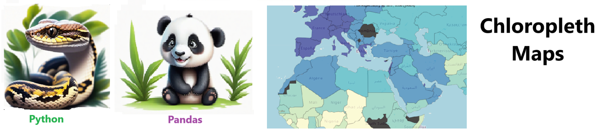

# Chloropleth Map - Fill in maps with clor values

## Chloropleth Map - Fill in maps with clor values !! 

## Features

- Dynamic and interactive 
- Map any region
- Map any index
- Makes complex Data simpler to understand
 

## Notebook Features

- Self Documenting 
- Self Testing 
- Easily Configurable
- Includes Talking Code 
- Self Logging 
- Self Debugging 

## Getting Started

To get started with the project, follow these steps:

1. Clone the repository to your local machine.
2. Install the required dependencies listed at the top of the notebook.
3. Explore the example code provided in the repository and experiment.
4. Run the notebook and your life is easier !

